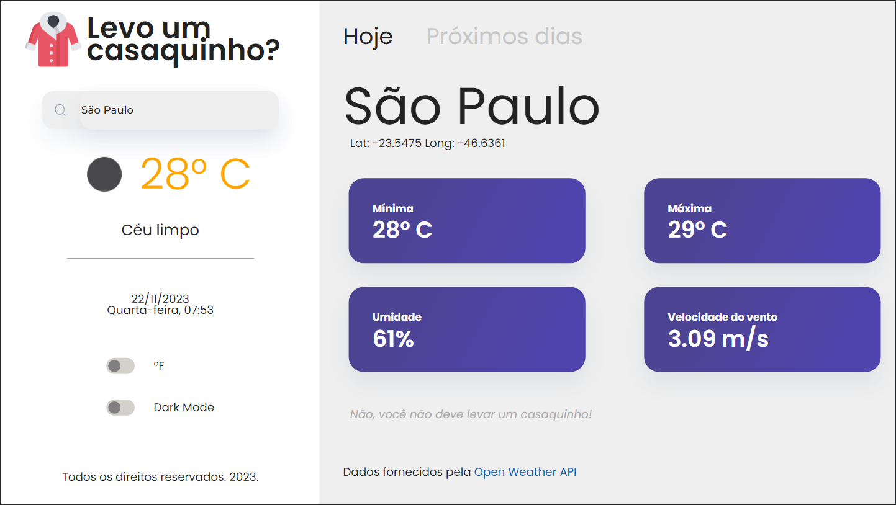

## Levo um casaquinho?

Uma das principais dores de quem vai dar um passeio ou pretende ir para algum destino por alguns dias é saber que roupa levar😫! Para isso fiz uma aplicação <strong>React+Vite</strong> onde é possível descobrir o clima e a temperatura do lugar que se vai viajar.

## Demo

<a href="https://desafio-tecnico-levo-um-casaquinho.vercel.app/">Clique Aqui</a>

## Preview

##### Design (Hoje)

##### Design (Hoje + DarkMode + Fahrenheit)

##### Design (Próximos Dias)

##### Design (Próximos Dias + DarkMode)

##### Responsividade de Cores a partir do clima

## Tecnologias e bibliotecas

- React
- Vite (5.0.1)
- Styled Components
- Axios
- Recharts
- DayJs

## Como rodar

1. Rode o comando `git clone https://github.com/CaioNeme/Desafio-Tecnico-Levo-um-casaquinho.git`
2. Rode o comando `cd Desafio-Tecnico-Levo-um-casaquinho`
3. Rode o comando `npm i`
4. Crie uma conta no site <a href="https://openweathermap.org/">OpenWeather</a> e salve sua `KEY`
5. Crie e configure um aquivo `.env` com a variavel `VITE_API_KEY` com a obtida a partir do OpenWeather
6. Rode o comando `npm run dev`
